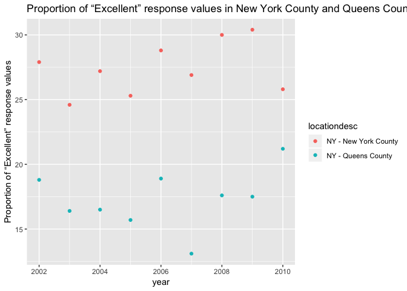

p8105\_hw2\_xw2598
================
Xinyao Wu
2018-10-02

problem1
--------

``` r
library(tidyverse)
```

    ## -- Attaching packages ---------------------------------------------------------- tidyverse 1.2.1 --

    ## √ ggplot2 3.0.0     √ purrr   0.2.5
    ## √ tibble  1.4.2     √ dplyr   0.7.6
    ## √ tidyr   0.8.1     √ stringr 1.3.1
    ## √ readr   1.1.1     √ forcats 0.3.0

    ## -- Conflicts ------------------------------------------------------------- tidyverse_conflicts() --
    ## x dplyr::filter() masks stats::filter()
    ## x dplyr::lag()    masks stats::lag()

``` r
nyc_data = read.csv("./data files/NYC_Transit_Subway_Entrance_And_Exit_Data.csv")%>% 
  #data clean
janitor::clean_names() %>% 
  #retain specific variables 
select(line:entry,vending,ada) %>% 
  #convert the variable entry from character to logic
 #gather(key="routes_served", value = "route_value",route1:route11 ) %>% 
mutate(
     entry=as.character(entry),
     entry = replace(entry,entry =="YES", "TRUE"),
       entry =replace(entry,entry =="NO","FALSE"),
       entry = as.logical(entry)
)
```

``` r
#new dataset variables
names(nyc_data) 
```

    ##  [1] "line"              "station_name"      "station_latitude" 
    ##  [4] "station_longitude" "route1"            "route2"           
    ##  [7] "route3"            "route4"            "route5"           
    ## [10] "route6"            "route7"            "route8"           
    ## [13] "route9"            "route10"           "route11"          
    ## [16] "entrance_type"     "entry"             "vending"          
    ## [19] "ada"

``` r
#The dimension of the resulting dataset
print("rows:")
```

    ## [1] "rows:"

``` r
nrow(nyc_data)
```

    ## [1] 1868

``` r
print("columns:")
```

    ## [1] "columns:"

``` r
ncol(nyc_data)
```

    ## [1] 19

This dataset contains variables: line,station name,station latitude,station longitude,route1,route2,route3,route4,route5,route6,route7,route8,route9,route10,route11,entrance type,entry,vending,ada. My data cleaning steps: 1.Change the variables names. 2.Select the specific variables according to the requirement. 3.Change the type of the data in "entry". The dimension of the resulting dataset is 1868 rows \* 19 columns.These data is not tidy enough, I suggest to gather all of the routes into one variable so I put related codes in the comment lines.

``` r
##The number of distinct stations:
#select the variables that can identify stations
n_station = select(nyc_data,line,station_name,ada) %>% 
distinct()
nrow(n_station)
```

    ## [1] 465

``` r
##The number of stations that are ADA compliant
ada_compliant = filter(n_station, ada=="TRUE") 
  nrow(ada_compliant)
```

    ## [1] 84

``` r
##The proportion of station entrances / exits without vending allow entrance
nrow(filter(nyc_data,vending=="NO",entry=="TRUE"))/nrow(filter(nyc_data,vending=="NO"))
```

    ## [1] 0.3770492

There are 465 distinct stations, and there are 84 stations that are ADA compliant.The proportion of station entrances / exits without vending allow entrance is 0.377.

``` r
#Reformat data so that route number and route name are distinct variables
new_nyc_data = nyc_data %>% 
gather(key="route_name", value = "route_number",route1:route11 ) %>% 
#Number of Dinstinct stations that serve the A train
select(line,station_name, route_name, route_number,ada) %>% 
  #filte A train
  filter(route_number == "A") 
```

    ## Warning: attributes are not identical across measure variables;
    ## they will be dropped

``` r
  #count distinct station serving A train
  A_station = distinct(new_nyc_data,line,station_name,.keep_all = TRUE) 
  nrow(A_station)
```

    ## [1] 60

``` r
# carculate number  of  ADA compliant in stations serving A train
  nrow(filter(A_station,ada=="TRUE"))
```

    ## [1] 17

``` r
# carculate proportion of  ADA compliant in stations serving A train
  nrow(filter(A_station,ada=="TRUE"))/nrow(A_station)
```

    ## [1] 0.2833333

60 distinct stations that serve the A train Of the stations that serve the A train, the number of ada compliant stations serving A train is , and the proportion of ADA compliant is 0.283.

problem 2
---------

Read and clean the Mr. Trash Wheel sheet:

``` r
library(readxl)
#read data and omit columns containing notes
trash = read_excel("./data files/HealthyHarborWaterWheelTotals2017-9-26.xlsx",range = "A2:N258") %>% 
  #data clean 
  janitor::clean_names() %>% 
  #omit rows that do not include dumpster-specific data
  filter(dumpster!="NA")
#rounds the number of sports balls and convert then into integer variables
trash$sports_balls = as.integer(round(trash$sports_balls))
```

``` r
#Read and clean precipitation data for 2017
precipitation_17 = read_excel("./data files/HealthyHarborWaterWheelTotals2017-9-26.xlsx",sheet = "2017 Precipitation",range = "A2:B15") %>% 
  janitor::clean_names() %>% 
#omit rows without precipitation data and add a variable year
  filter(total != "NA") 
  precipitation_17$year =  c(rep(2017,9))

#same pipline in 2016 
precipitation_16 = read_excel("./data files/HealthyHarborWaterWheelTotals2017-9-26.xlsx",sheet = "2016 Precipitation",range = "A2:B15") %>%
  janitor::clean_names() %>% 
   filter(total != "NA") 
  precipitation_16$year =  c(rep(2016,13))
#combine datasets and convert month to a character variable
  precipitation = left_join(precipitation_16, precipitation_17, by = "month",suffix = c(".16", ".17"))
  precipitation$month = month.name[precipitation$month]
  precipitation = select(precipitation,month, starts_with("total")) %>% 
    gather(key="year",value = "total",starts_with("total")) %>% 
    mutate(
      year = replace(year, year == "total.16","2016"),
      year = replace(year, year == "total.17","2017")
    ) %>% 
    filter(total != "NA")
    
##About these data
  head(precipitation)
```

    ## # A tibble: 6 x 3
    ##   month    year  total
    ##   <chr>    <chr> <dbl>
    ## 1 January  2016   3.23
    ## 2 February 2016   5.32
    ## 3 March    2016   2.24
    ## 4 April    2016   1.78
    ## 5 May      2016   5.19
    ## 6 June     2016   3.2

``` r
#The separate datas (2016 and 2017) respectively include 3 variables : month ,total precipitation and year.Their combination dataset(named precipitation) includes 3 variables:month,total precipitation,year
#Key variables: total precipitation. Because this is the core of this dataset.other variables are made for organizing and grouping "precipitation".
  
  
  # +mr.trash
  # change dataset
  
# total precipitation in 2017
  sum(filter(precipitation_17,month != "NA")$total)
```

    ## [1] 29.93

``` r
# the median number of sports balls in a dumpster in 2016
  median(filter(trash,year=="2016")$sports_balls)
```

    ## [1] 26

The total precipitation in 2017 is 29.93 and the median number of sports balls in a dumpster in 2016 is 26.

problem3
--------

``` r
# install.packages("devtools")
#devtools::install_github("p8105/p8105.datasets")
library(p8105.datasets)
data(brfss_smart2010)
#change object name
brfss = brfss_smart2010 %>% 
#clean data and use appropriate variable names
janitor::clean_names() %>% 
#focus on the “Overall Health” topic
filter(topic == "Overall Health") %>% 
#exclude sprcific variables according to the requirement
select(-class,-topic,-question,-sample_size,-confidence_limit_low:-geo_location) %>%   
#structure data according to the requirement
spread(key = response, value = data_value) %>% 
janitor::clean_names() %>% 
#create a new variable showing the proportion "excellent|very good"
mutate(
  positive_prop = excellent + very_good
)
rm(brfss_smart2010)
```

@format the data to use appropriate variable names; @focus on the “Overall Health” topic @exclude variables for class, topic, question, sample size, and everything from lower confidence limit to GeoLocation @structure data so that values for Response (“Excellent” to “Poor”) are column names / variables which indicate the proportion of subjects with each response (which are values of Data\_value in the original dataset) @create a new variable showing the proportion of responses that were “Excellent” or “Very Good” Using this dataset, do or answer the following:

``` r
#datatset information
head(brfss)
```

    ## # A tibble: 6 x 9
    ##    year locationabbr locationdesc excellent  fair  good  poor very_good
    ##   <int> <chr>        <chr>            <dbl> <dbl> <dbl> <dbl>     <dbl>
    ## 1  2002 AK           AK - Anchor~      27.9   8.6  23.8   5.9      33.7
    ## 2  2002 AL           AL - Jeffer~      18.5  12.1  32.7   5.9      30.9
    ## 3  2002 AR           AR - Pulask~      24.1  12.5  29.9   4.2      29.3
    ## 4  2002 AZ           AZ - Marico~      21.6  10.3  26.9   4.6      36.6
    ## 5  2002 AZ           AZ - Pima C~      26.6   7.5  31.9   3.9      30.1
    ## 6  2002 CA           CA - Los An~      22.7  14.3  28.7   4.5      29.8
    ## # ... with 1 more variable: positive_prop <dbl>

``` r
#unique locations
nrow(distinct(select(brfss,locationdesc)))
```

    ## [1] 404

``` r
#state number
nrow(distinct(select(brfss,locationabbr)))
```

    ## [1] 51

``` r
#top 5 observed state
count_state = group_by(brfss,locationabbr)
tail(arrange(count(count_state,locationabbr),n),5)
```

    ## # A tibble: 5 x 2
    ## # Groups:   locationabbr [5]
    ##   locationabbr     n
    ##   <chr>        <int>
    ## 1 MD              90
    ## 2 WA              97
    ## 3 NC             115
    ## 4 FL             122
    ## 5 NJ             146

``` r
#The median of the “Excellent” response value in 2002
median(filter(brfss, year == "2002")$excellent, na.rm = TRUE)
```

    ## [1] 23.6

There are 404 unique locations are included in the dataset. Every state is represented. NJ is observed the most.The median of the “Excellent” response value in 2002 is 23.6.

``` r
#Histogram of “Excellent” response values in the year 2002
hist_brfss = filter(brfss, year == "2002") %>% 
  select(locationabbr,excellent)
ggplot(hist_brfss,aes(x = excellent )) +
  geom_histogram(alpha = 0.5,colour = "blue") +
  scale_x_continuous(breaks = c(10, 15, 20,25,30,40), 
                     labels = c("10", "15", "20","25","30","40"))+
   labs(
    title = "Histogram of “Excellent” response values in the year 2002 ",
    x = "Excellent” response values",
    y = "counts")
```

    ## `stat_bin()` using `bins = 30`. Pick better value with `binwidth`.

    ## Warning: Removed 2 rows containing non-finite values (stat_bin).

 This histogram is skewed and shows that most of the data(excellet proportion) are crowded in 19-28.

``` r
#scatterplot
# prepare dataset
scatt_brfss = filter(brfss, locationdesc =="NY - New York County"|locationdesc == "NY - Queens County", year<= 2010 & year >= 2002 ) %>% 
  select(year, locationdesc, excellent)

#proportion of “Excellent” response values plot
ggplot(scatt_brfss,aes(x = year, y = excellent, color = locationdesc ))+
  geom_point()+
  labs(
    title = "Proportion of “Excellent” response values in New York County and Queens County",
    y = "Proportion of “Excellent” response values")
```



This scatterplot shows that the proportion of “Excellent” response values in New York County is always higher than that in Queens County. The difference is obvious and stable, which can be caused by county\`s own characters.
